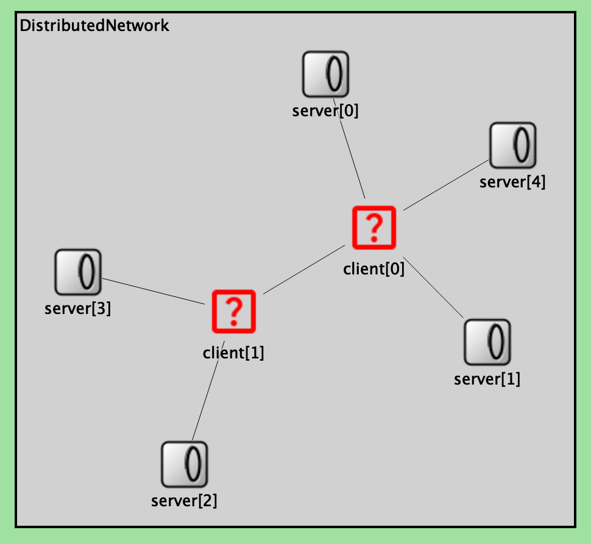
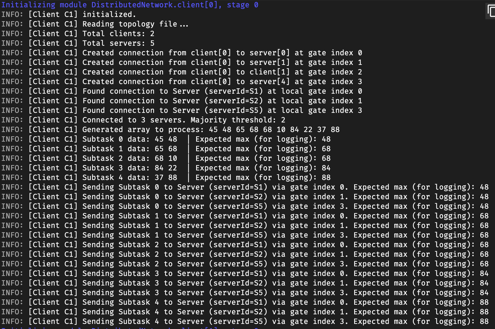
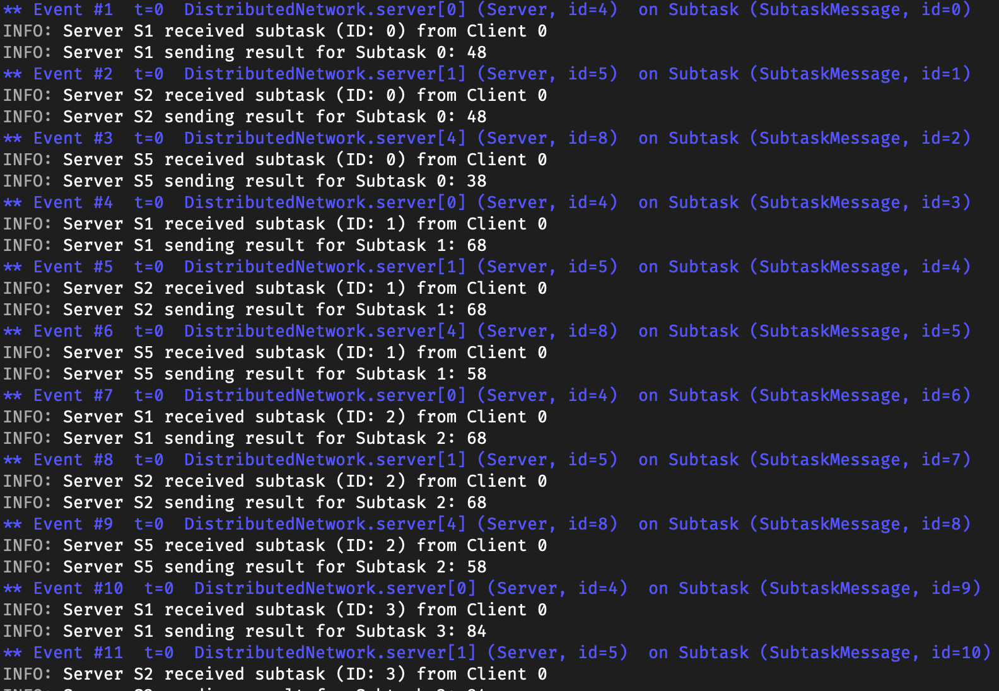
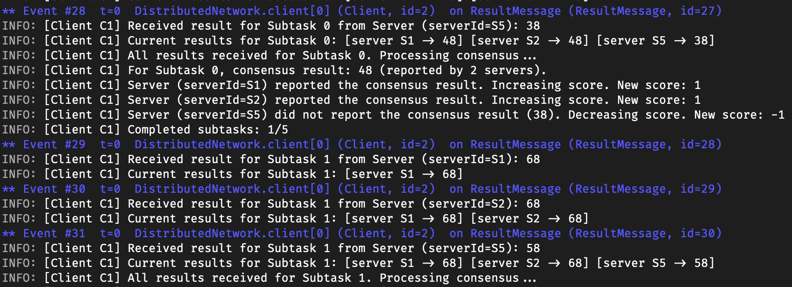
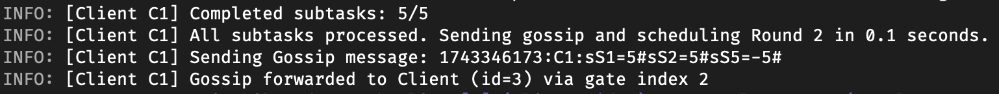

# 🔪 Distributed Client-Server Simulation (OMNeT++)

This project is a part of a course IITJ CSL3080.<br>
This project demonstrates a distributed client-server system using **OMNeT++**, where clients distribute tasks, collect results from servers, and share gossip to refine server scores based on consensus.

---

## 🛠️ OMNeT++ Setup on macOS

### Step 1: Install Prerequisites

Install Xcode Command Line Tools:
```bash
xcode-select --install
```

(Optional) Install Homebrew:
```bash
/bin/bash -c "$(curl -fsSL https://raw.githubusercontent.com/Homebrew/install/HEAD/install.sh)"
```

### Step 2: Download and Build OMNeT++

1. Go to the [OMNeT++ official site](https://omnetpp.org).
2. Download the latest version (e.g., `omnetpp-6.1`).
3. Extract the archive:
   ```bash
   tar xzf omnetpp-6.1-src.tgz
   cd omnetpp-6.1
   ```
4. Build OMNeT++:
   ```bash
   ./configure
   make
   ```
5. Add OMNeT++ to your shell environment (optional):
   ```bash
   echo 'source ~/path-to/omnetpp-6.1/setenv' >> ~/.zshrc
   source ~/.zshrc
   ```

---

## 🚀 Project Overview

### 🔹 Modules

- **Client Module**:
  - Generates a random integer array.
  - Splits it into 5 **subtasks**.
  - Sends each subtask to **all connected servers** with a unique `subtaskId`.
  - Waits for all results, then uses **majority voting (consensus)**.
  - Updates server scores and shares them with peers using **gossip messages**.
  - Initiates a second round with top servers based on aggregated scores.

- **Server Module**:
  - Receives subtasks from clients.
  - Computes the maximum (or a modified value if marked malicious).
  - Sends a result message back, including the corresponding `subtaskId`.

---

## 🔄 Message Types

- `SubtaskMessage`: Sent from client to server; contains `clientId`, `subtaskId`, and data.
- `ResultMessage`: Sent from server to client; contains `clientId`, `subtaskId`, and result.
- `GossipMessage`: Exchanged between clients to share server scores.

---

## 📃 Building and Running the Simulation

### Build the Project:
```bash
cd src
make
```

### Run the Simulation:
- Launch OMNeT++ IDE (Qtenv) or use `opp_run`.
- Open your project and start the simulation with `omnetpp.ini`.

### Observe Output:
Check the EV console for:
- Subtask distribution and results
- Consensus results and score changes
- Gossip messages
- Round 2 subtask flow

---

## 📷 Screenshots and Logs

Add your simulation outputs below:

### Simulation Topology


### Initialization Log


### Server Result Log


### Client Result Log


### Client Gossip Exchange



---

## 🔧 Customization and Future Work

- Modify number of subtasks or array size.
- Enhance gossip logic with timestamps or weights.
- Introduce crash-fault or Byzantine models.
- Implement dynamic server selection policies.

---

## 📅 License

This project is licensed under MIT license.

---

## 👏 Acknowledgements

- OMNeT++ official documentation and community.
- Awathare Nitin Niranjan(Course Instructor CSL3080)
- Abhishek Yadav.

---